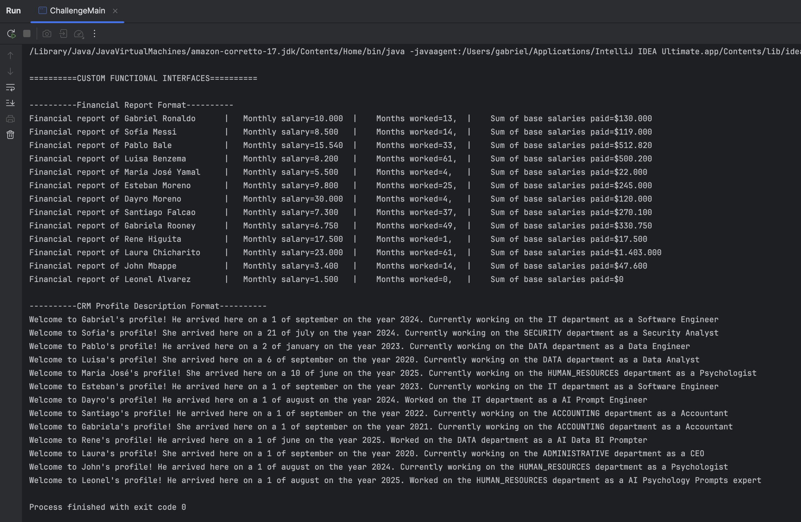
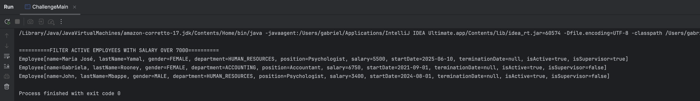
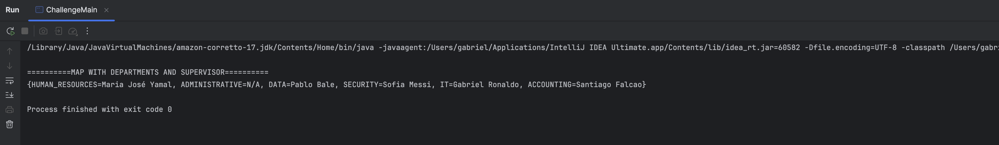
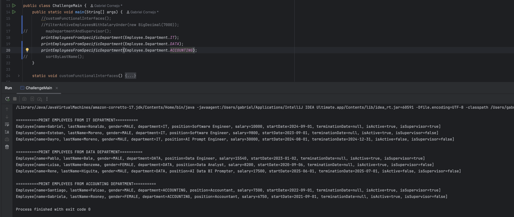
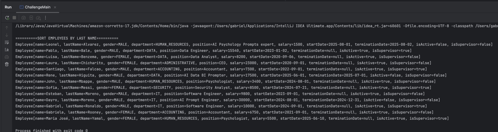

# Taller práctico clase 1 Programación funcional

En el presente repositorio se realiza la solución al ejercicio planteado con las respectivas evidencias. Para la realización de este ejercicio y los siguientes
se toma la decisión de crear nuevas clases las cuales se encuentran bajo el paquete `challenge`. En este se creó una nueva clase main y una nueva clase
para representar a los empleados. Ya que en el taller priorizamos la inmutabilidad se decidió utilizar un Java Record.

- [Enunciado](#enunciado)
- [Interfaz Funcional Personalizada](#interfaz-funcional-personalizada-para-formato)
- [Predicate](#predicate-filtrar-empleados-activos-con-salario-menor-a-7000)
- [Function](#function-mapa-departamentos-con-supervisor-respectivo)
- [Consumer](#consumer-imprimir-empleados-de-un-determinado-departamento)
- [Comparator](#comparator-ordenar-por-apellido)

## Enunciado

Dada la clase `Empleado.java`, implementa una interfaz funcional personalizada con un método llamado `format` que recibe como parámetro un **Empleado** y devuelve un **String**.

Posteriormente, crea dos formatos diferentes para mostrar la información del empleado (Ejemplo: **Reporte de nómina** y **Ficha personal**).

Adicional, con las interfaces funcionales de Java, evalúa lo siguiente:

* **Predicate:** Filtrar empleados activos con salario menor a 700 USD.
* **Function:** Generar un mapa que almacene como clave un departamento y como valor el supervisor de dicho departamento.
* **Consumer:** Imprimir en consola un listado de empleados de un determinado departamento.
* **Comparator:** Ordena a los empleados por su apellido en orden alfabético.

> **Nota:** NO utilizar `.stream()`

### Criterios de evaluación

| Criterio                                                                                      | Puntos  |
| --------------------------------------------------------------------------------------------- | ------- |
| Interfaz funcional personalizada correctamente implementada                                   | 30      |
| Interfaz funcional Predicate correctamente implementada                                       | 10      |
| Interfaz funcional Function correctamente implementada                                        | 10      |
| Interfaz funcional Consumer correctamente implementada                                        | 10      |
| Interfaz funcional Comparator correctamente implementada                                      | 10      |
| Captura de pantalla que muestra los puntos anteriores funcionando correctamente en la consola | 30      |
| **Total**                                                                                     | **100** |

---

## Interfaz funcional personalizada para formato

La solución a este punto se encuentra en `ChallengeMain.customFunctionalInterfaces()`. Donde se realizan dos implementaciones
de la interfaz personalizada. Una para un reporte financiero y la otra es como una descripción de un perfil de un CRM.



---

## Predicate filtrar empleados activos con salario menor a 7000

La solución a este punto se encuentra en `ChallengeMain.filterActiveEmployeesWithSalaryUnder()`. Acá se cambió el valor
de 700 a 7000 porque en mi empresa imaginaria mis amiguitos ganan mucho dinero.



---

## Function mapa departamentos con supervisor respectivo

La solución a este punto se encuentra en `ChallengeMain.mapDepartmentAndSupervisor()`. Acá se cubrió también el caso de
que colocar en caso tal de que hayan empleados con un departamento sin supervisor.



---

## Consumer imprimir empleados de un determinado departamento

La solución a este punto se encuentra en `ChallengeMain.printEmployeesFromSpecificDepartment()`. En el siguiente pantallazo
se muestra la invocación de la función 3 veces cada una con distinto departamento.



---

## Comparator ordenar por apellido

La solución a este punto se encuentra en `ChallengeMain.sortByLastName()`.



---

## Output completo

```

==========CUSTOM FUNCTIONAL INTERFACES==========

----------Financial Report Format----------
Financial report of Gabriel Ronaldo      |	 Monthly salary=10.000 	|	 Months worked=13, 	|	 Sum of base salaries paid=$130.000
Financial report of Sofia Messi          |	 Monthly salary=8.500 	|	 Months worked=14, 	|	 Sum of base salaries paid=$119.000
Financial report of Pablo Bale           |	 Monthly salary=15.540 	|	 Months worked=33, 	|	 Sum of base salaries paid=$512.820
Financial report of Luisa Benzema        |	 Monthly salary=8.200 	|	 Months worked=61, 	|	 Sum of base salaries paid=$500.200
Financial report of Maria José Yamal     |	 Monthly salary=5.500 	|	 Months worked=4, 	|	 Sum of base salaries paid=$22.000
Financial report of Esteban Moreno       |	 Monthly salary=9.800 	|	 Months worked=25, 	|	 Sum of base salaries paid=$245.000
Financial report of Dayro Moreno         |	 Monthly salary=30.000 	|	 Months worked=4, 	|	 Sum of base salaries paid=$120.000
Financial report of Santiago Falcao      |	 Monthly salary=7.300 	|	 Months worked=37, 	|	 Sum of base salaries paid=$270.100
Financial report of Gabriela Rooney      |	 Monthly salary=6.750 	|	 Months worked=49, 	|	 Sum of base salaries paid=$330.750
Financial report of Rene Higuita         |	 Monthly salary=17.500 	|	 Months worked=1, 	|	 Sum of base salaries paid=$17.500
Financial report of Laura Chicharito     |	 Monthly salary=23.000 	|	 Months worked=61, 	|	 Sum of base salaries paid=$1.403.000
Financial report of John Mbappe          |	 Monthly salary=3.400 	|	 Months worked=14, 	|	 Sum of base salaries paid=$47.600
Financial report of Leonel Alvarez       |	 Monthly salary=1.500 	|	 Months worked=0, 	|	 Sum of base salaries paid=$0

----------CRM Profile Description Format----------
Welcome to Gabriel's profile! He arrived here on a 1 of september on the year 2024. Currently working on the IT department as a Software Engineer
Welcome to Sofia's profile! She arrived here on a 21 of july on the year 2024. Currently working on the SECURITY department as a Security Analyst
Welcome to Pablo's profile! He arrived here on a 2 of january on the year 2023. Currently working on the DATA department as a Data Engineer
Welcome to Luisa's profile! She arrived here on a 6 of september on the year 2020. Currently working on the DATA department as a Data Analyst
Welcome to Maria José's profile! She arrived here on a 10 of june on the year 2025. Currently working on the HUMAN_RESOURCES department as a Psychologist
Welcome to Esteban's profile! He arrived here on a 1 of september on the year 2023. Currently working on the IT department as a Software Engineer
Welcome to Dayro's profile! He arrived here on a 1 of august on the year 2024. Worked on the IT department as a AI Prompt Engineer
Welcome to Santiago's profile! He arrived here on a 1 of september on the year 2022. Currently working on the ACCOUNTING department as a Accountant
Welcome to Gabriela's profile! She arrived here on a 1 of september on the year 2021. Currently working on the ACCOUNTING department as a Accountant
Welcome to Rene's profile! He arrived here on a 1 of june on the year 2025. Worked on the DATA department as a AI Data BI Prompter
Welcome to Laura's profile! She arrived here on a 1 of september on the year 2020. Currently working on the ADMINISTRATIVE department as a CEO
Welcome to John's profile! He arrived here on a 1 of august on the year 2024. Currently working on the HUMAN_RESOURCES department as a Psychologist
Welcome to Leonel's profile! He arrived here on a 1 of august on the year 2025. Worked on the HUMAN_RESOURCES department as a AI Psychology Prompts expert

==========FILTER ACTIVE EMPLOYEES WITH SALARY OVER 7000==========
Employee[name=Maria José, lastName=Yamal, gender=FEMALE, department=HUMAN_RESOURCES, position=Psychologist, salary=5500, startDate=2025-06-10, terminationDate=null, isActive=true, isSupervisor=true]
Employee[name=Gabriela, lastName=Rooney, gender=FEMALE, department=ACCOUNTING, position=Accountant, salary=6750, startDate=2021-09-01, terminationDate=null, isActive=true, isSupervisor=false]
Employee[name=John, lastName=Mbappe, gender=MALE, department=HUMAN_RESOURCES, position=Psychologist, salary=3400, startDate=2024-08-01, terminationDate=null, isActive=true, isSupervisor=false]

==========MAP WITH DEPARTMENTS AND SUPERVISOR==========
{HUMAN_RESOURCES=Maria José Yamal, ADMINISTRATIVE=N/A, DATA=Pablo Bale, SECURITY=Sofia Messi, IT=Gabriel Ronaldo, ACCOUNTING=Santiago Falcao}

==========PRINT EMPLOYEES FROM IT DEPARTMENT==========
Employee[name=Gabriel, lastName=Ronaldo, gender=MALE, department=IT, position=Software Engineer, salary=10000, startDate=2024-09-01, terminationDate=null, isActive=true, isSupervisor=true]
Employee[name=Esteban, lastName=Moreno, gender=MALE, department=IT, position=Software Engineer, salary=9800, startDate=2023-09-01, terminationDate=null, isActive=true, isSupervisor=false]
Employee[name=Dayro, lastName=Moreno, gender=MALE, department=IT, position=AI Prompt Engineer, salary=30000, startDate=2024-08-01, terminationDate=2024-12-31, isActive=false, isSupervisor=false]

==========PRINT EMPLOYEES FROM DATA DEPARTMENT==========
Employee[name=Pablo, lastName=Bale, gender=MALE, department=DATA, position=Data Engineer, salary=15540, startDate=2023-01-02, terminationDate=null, isActive=true, isSupervisor=true]
Employee[name=Luisa, lastName=Benzema, gender=FEMALE, department=DATA, position=Data Analyst, salary=8200, startDate=2020-09-06, terminationDate=null, isActive=true, isSupervisor=false]
Employee[name=Rene, lastName=Higuita, gender=MALE, department=DATA, position=AI Data BI Prompter, salary=17500, startDate=2025-06-01, terminationDate=2025-07-01, isActive=false, isSupervisor=false]

==========PRINT EMPLOYEES FROM ACCOUNTING DEPARTMENT==========
Employee[name=Santiago, lastName=Falcao, gender=MALE, department=ACCOUNTING, position=Accountant, salary=7300, startDate=2022-09-01, terminationDate=null, isActive=true, isSupervisor=true]
Employee[name=Gabriela, lastName=Rooney, gender=FEMALE, department=ACCOUNTING, position=Accountant, salary=6750, startDate=2021-09-01, terminationDate=null, isActive=true, isSupervisor=false]

==========SORT EMPLOYEES BY LAST NAME==========
Employee[name=Leonel, lastName=Alvarez, gender=MALE, department=HUMAN_RESOURCES, position=AI Psychology Prompts expert, salary=1500, startDate=2025-08-01, terminationDate=2025-08-02, isActive=false, isSupervisor=false]
Employee[name=Pablo, lastName=Bale, gender=MALE, department=DATA, position=Data Engineer, salary=15540, startDate=2023-01-02, terminationDate=null, isActive=true, isSupervisor=true]
Employee[name=Luisa, lastName=Benzema, gender=FEMALE, department=DATA, position=Data Analyst, salary=8200, startDate=2020-09-06, terminationDate=null, isActive=true, isSupervisor=false]
Employee[name=Laura, lastName=Chicharito, gender=FEMALE, department=ADMINISTRATIVE, position=CEO, salary=23000, startDate=2020-09-01, terminationDate=null, isActive=true, isSupervisor=false]
Employee[name=Santiago, lastName=Falcao, gender=MALE, department=ACCOUNTING, position=Accountant, salary=7300, startDate=2022-09-01, terminationDate=null, isActive=true, isSupervisor=true]
Employee[name=Rene, lastName=Higuita, gender=MALE, department=DATA, position=AI Data BI Prompter, salary=17500, startDate=2025-06-01, terminationDate=2025-07-01, isActive=false, isSupervisor=false]
Employee[name=John, lastName=Mbappe, gender=MALE, department=HUMAN_RESOURCES, position=Psychologist, salary=3400, startDate=2024-08-01, terminationDate=null, isActive=true, isSupervisor=false]
Employee[name=Sofia, lastName=Messi, gender=FEMALE, department=SECURITY, position=Security Analyst, salary=8500, startDate=2024-07-21, terminationDate=null, isActive=true, isSupervisor=true]
Employee[name=Esteban, lastName=Moreno, gender=MALE, department=IT, position=Software Engineer, salary=9800, startDate=2023-09-01, terminationDate=null, isActive=true, isSupervisor=false]
Employee[name=Dayro, lastName=Moreno, gender=MALE, department=IT, position=AI Prompt Engineer, salary=30000, startDate=2024-08-01, terminationDate=2024-12-31, isActive=false, isSupervisor=false]
Employee[name=Gabriel, lastName=Ronaldo, gender=MALE, department=IT, position=Software Engineer, salary=10000, startDate=2024-09-01, terminationDate=null, isActive=true, isSupervisor=true]
Employee[name=Gabriela, lastName=Rooney, gender=FEMALE, department=ACCOUNTING, position=Accountant, salary=6750, startDate=2021-09-01, terminationDate=null, isActive=true, isSupervisor=false]
Employee[name=Maria José, lastName=Yamal, gender=FEMALE, department=HUMAN_RESOURCES, position=Psychologist, salary=5500, startDate=2025-06-10, terminationDate=null, isActive=true, isSupervisor=true]

```
