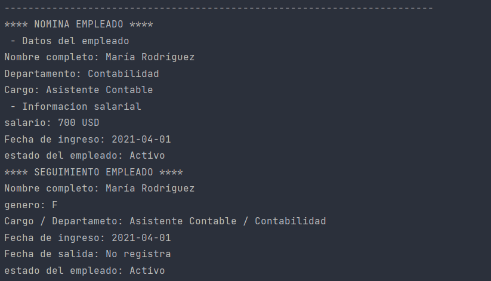
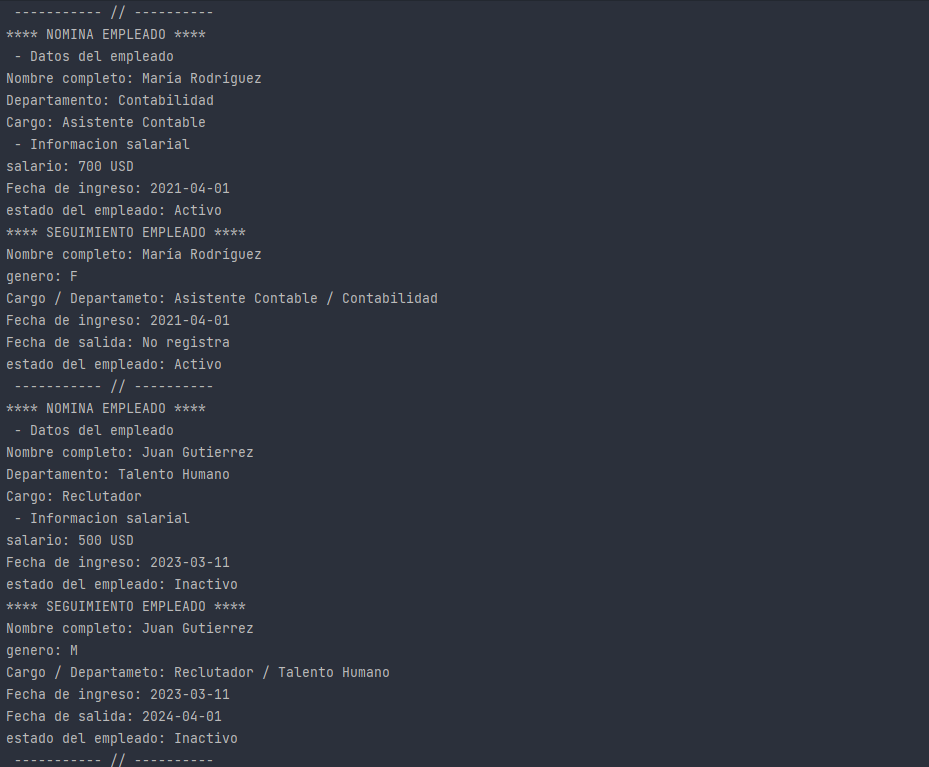
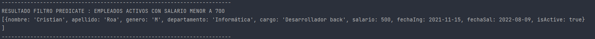
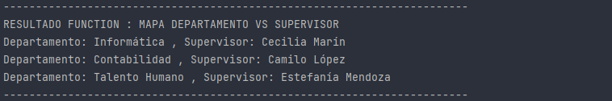
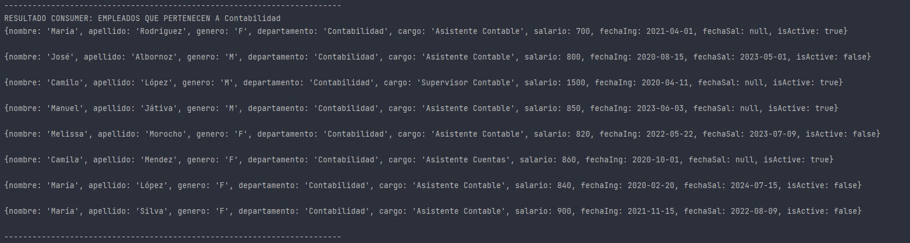
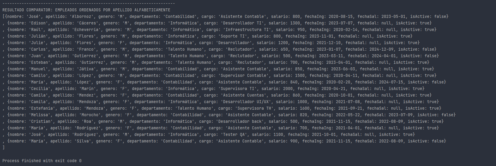

## Formacion L5: Programación Funcionl Lambdas y Streams - Desafio 1

A continuación se presentan los resultados del desafio propuesto para la clase 1 del
curso: *Formacion L5: Programación Funcionl Lambdas y Streams*

### Resultados

1. **interfaces funcionales personalidas**:
[FormatterEmployeeInformation.java](src/principles/interfaces/FormatterEmployeeInformation.java)

   *Resultado*:
    
    1. Aplicación formato nómina
       
   
    2. Aplicación formato seguimiento empleado
       

2. **Interfaces funcionales JAVA**:

    *Resultado*:

   1. Predicate: Filtrar empleados activos con salario menor a 700 USD
   
   2. Function: Generar un mapa que almacene como clave un departamento y como valor un supervisor de dicho departamento
   
   3. Consumer: Imprimir en consola un listado de empleados de un determinado departamento
   
   4. Comparator: Ordena los empleados por su apellido en orden alfabetico
   

